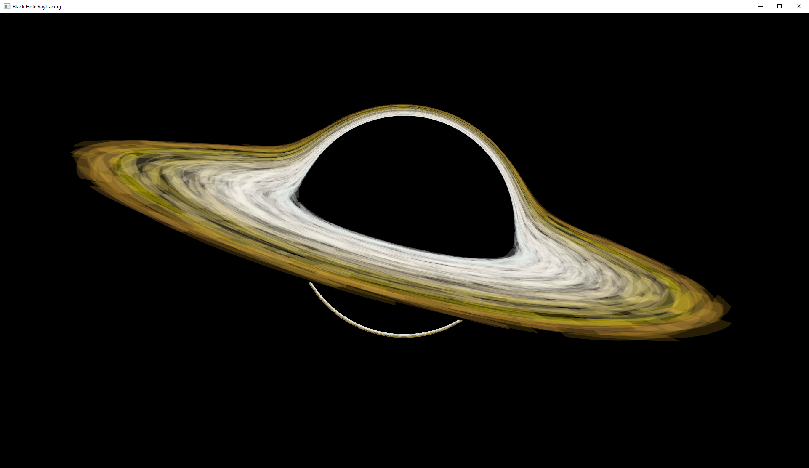

# BlackHoleRaytracing

This is a simple OpenGL project (written in C++ and GLSL) to render the light bending in the vicinity of a black hole in real time. The rendering is achieved using a path tracing algorithm, simulating the curved path of each ray as it passes through a Schwarzschild metric. The accretion disc is represented by a flat, textured disc.

## Requirements
GLEW: http://glew.sourceforge.net/

GLM: https://github.com/g-truc/glm/

GLFW: https://www.glfw.org/

## Example

